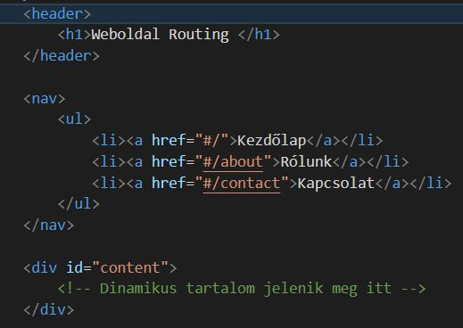
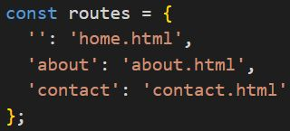
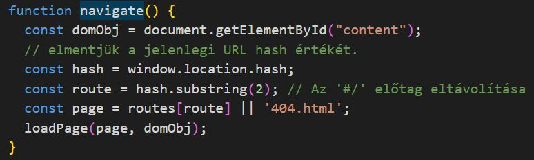
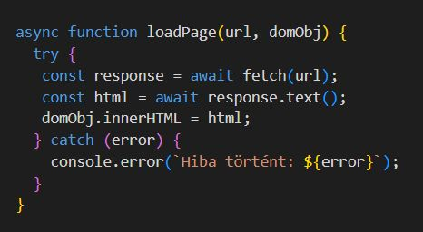

# How to build routing with Javascript without frameworks

- a HTML fájlban létrehozunk egy tárolót aminek a tartalmát programozottan rendereljük:

- Objektum, amely a hash értékekhez tartozó útvonalakat tartalmazza:

- A hash változását figyeljük, és frissítjük a tartalmat:
    > window.addEventListener("hashchange", ()=>navigate());
- A megfelelő oldalt jelenítjük meg a hash alapján:

- a fetch APIval betöltjük a kiválasztott oldalt:
  

